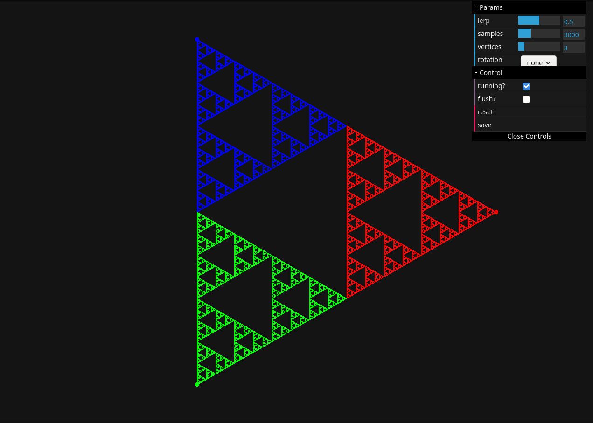
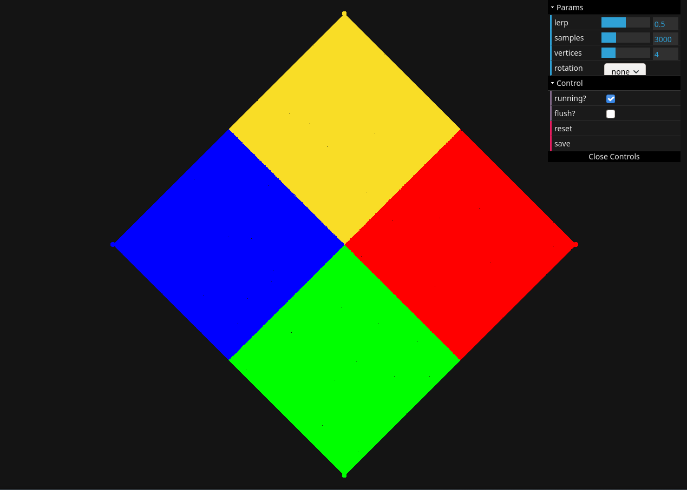
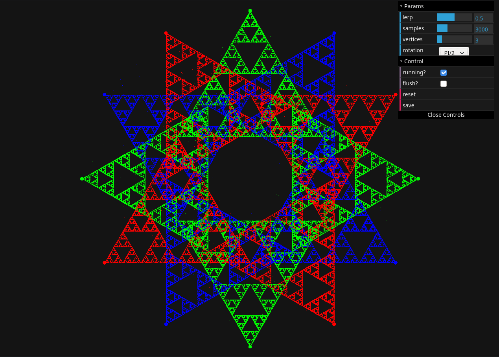

# Chaos Game
Simple implementation of the [chaos game](https://en.wikipedia.org/wiki/Chaos_game) using p5.js  

Play [**here**](https://takaiten.github.io/chaos-game-p5js/)

#### Sierpiński triangle (3 vertices)

#### Square (4 vertices)

#### Other interesting things 

